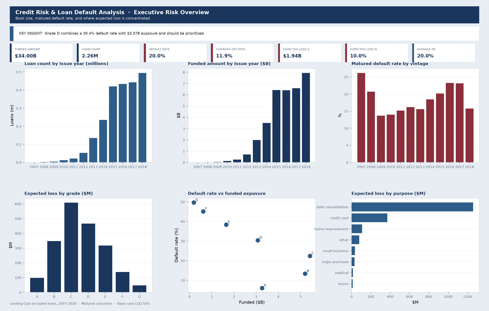
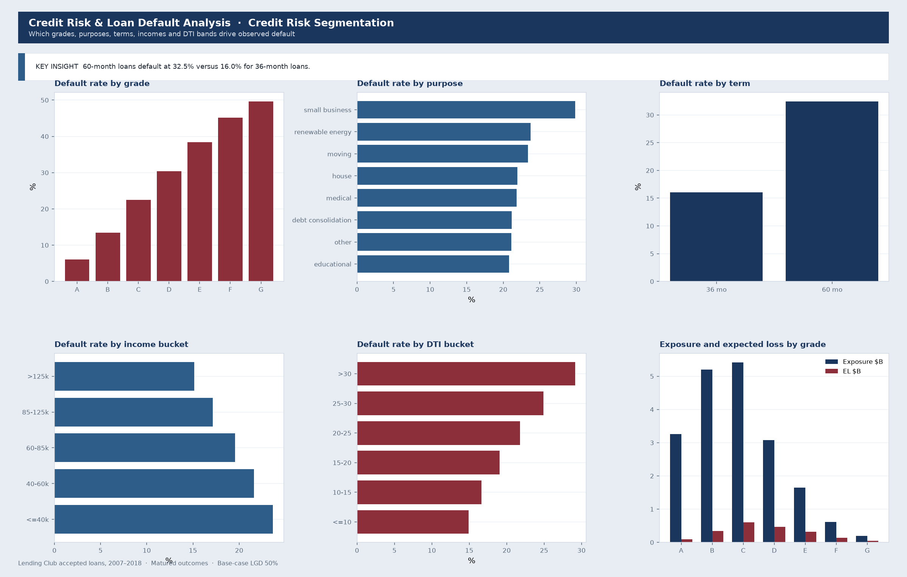
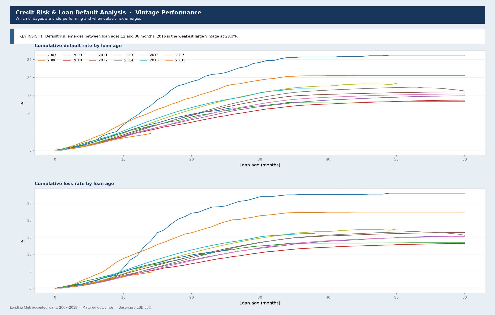
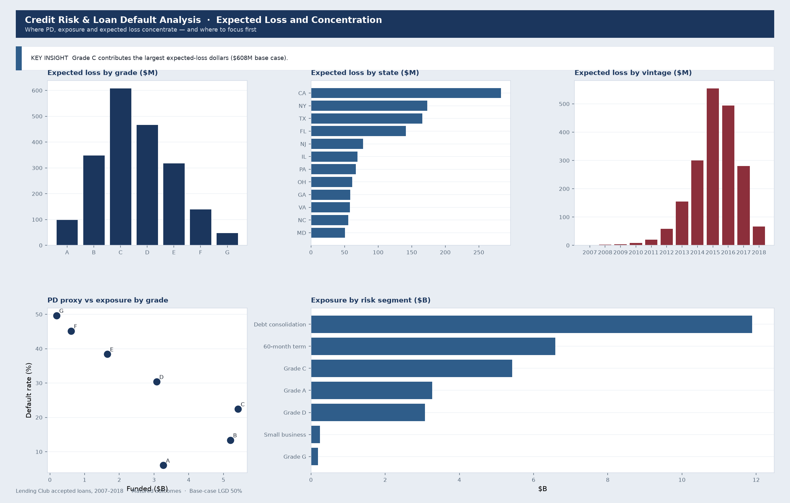
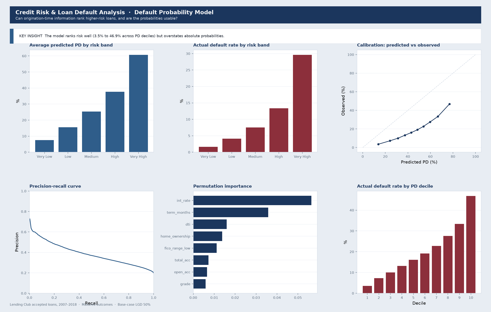
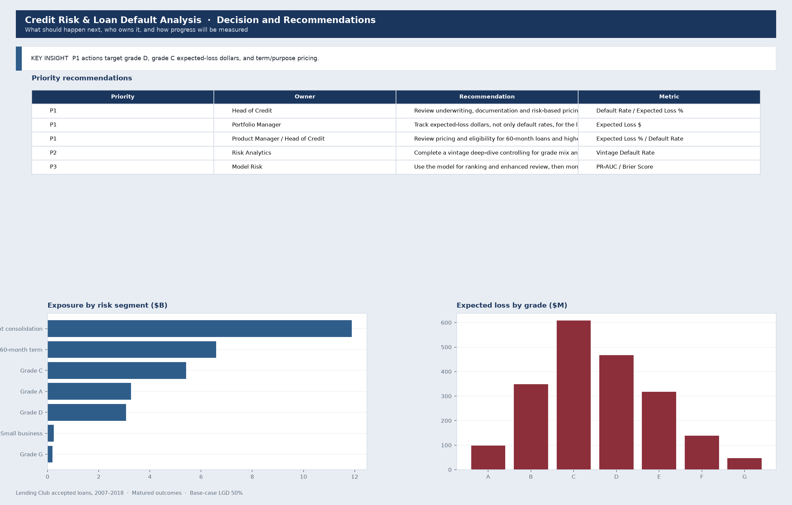

# Credit Risk & Loan Default Analysis

Lending Club Portfolio Risk, Vintage Performance, Expected Loss & Default Probability Analysis

This project analyses Lending Club accepted loans to identify where credit risk and expected loss are concentrated, assess how risk evolved across loan vintages, estimate expected losses under documented assumptions, develop a calibrated probability-of-default model, and translate the evidence into Tableau-ready views and portfolio recommendations.

It is a data-analyst and risk-analytics case study. The model supports ranking and monitoring. It does not approve or decline an applicant.

## Business problem

Lending institutions need to balance portfolio growth with credit risk. Management requires evidence-based analysis to identify high-risk borrower and loan segments, understand how default risk changes over time, estimate potential losses, and determine where underwriting, pricing, monitoring or portfolio-management actions should be considered.

**Where is credit risk concentrated, why is it occurring, how much potential loss does it represent, and what actions should the business take?**

## Business questions

- How large is the loan portfolio and how much was funded?
- What is the overall default rate on matured loans?
- Which grades, purposes, terms, incomes, DTI bands and states show elevated risk?
- Which vintages perform best or worst, and at what loan age does risk accelerate?
- Which segments combine high exposure with high probability of default?
- Can origination-time information rank higher-risk loans?
- What should underwriting, pricing and monitoring do next?

## Dataset

Lending Club loan data published on Kaggle: [wordsforthewise/lending-club](https://www.kaggle.com/datasets/wordsforthewise/lending-club).

The accepted-loan file is the primary source. Raw files are not stored in Git. Download and placement instructions are in `data/README.md`.

## Data governance

Raw extracts stay local. Credentials are never committed. Target definitions, leakage exclusions, LGD assumptions and quality rules are documented in `docs/`. Ownership, lineage and ethics are written for a credit-risk audience, not only a data-science audience.

## Methodology

Five analytical layers:

1. Portfolio analytics
2. Credit-risk segmentation
3. Vintage / cohort performance
4. Expected loss = PD × LGD × EAD
5. Origination-time probability of default

Default rate uses matured loans only. Current, late and in-grace loans are excluded from the binary target. Post-origination payment, recovery and settlement fields are excluded from the model.

## Key KPIs

| KPI | Definition |
| --- | --- |
| Default Rate | Defaults / matured loans |
| Charged-Off Rate | Charged-off loans / originated loans |
| Expected Loss $ | PD × LGD × EAD |
| Expected Loss % | Expected loss / funded exposure |
| PD | Observed matured default rate or model probability |
| EAD | Funded amount in this study |

## North Star Metric

Risk-adjusted portfolio performance, expressed as expected loss relative to exposure. Rates alone can overstate a tiny high-risk niche and understate a large mid-risk segment.

## Key findings

Analysis of **2,260,701 accepted loans** (2007–2018 Q4) shows:

| Metric | Value |
| --- | --- |
| Total funded amount | $34.0B |
| Matured loans | 1,348,099 |
| Matured default rate | 20.0% |
| Charged-off rate (all originated) | 11.9% |
| Base-case expected loss | $1.94B (10.0% of matured exposure at 50% LGD) |
| Average loan amount | $15,047 |
| Average interest rate | 13.1% |

**Risk concentration**

- Grade A defaulted at **6.0%**; grade G at **49.7%**.
- Grade **D** is the high-rate, high-exposure **Prioritise** cell (30.4% default rate, $3.07B exposure).
- Grade **C** contributes the most expected-loss dollars (**$608M** base case) because of volume.
- **60-month** loans defaulted at **32.5%** versus **16.0%** for 36-month loans.
- **Small business** purpose defaulted at **29.9%**; **debt consolidation** drives the largest purpose-level expected-loss dollars.
- Among large matured vintages, **2016–2017** are the weakest; **2009** is the strongest.

**Model**

- Champion model: **HistGradientBoosting** (PR-AUC **0.387**, ROC-AUC **0.720**).
- Validation default rate rises from **3.5%** (lowest PD decile) to **46.9%** (highest decile).
- Scores are useful for **ranking and review**, not as a calibrated capital PD.

Full narrative: `outputs/reports/executive_summary.md`

## Recommendations

The live recommendation matrix is `outputs/tables/recommendation_matrix.csv`. Priorities are assigned from evidence:

- P1: high PD with material exposure, or high expected-loss concentration
- P2: vintage or mix investigations
- P3: monitoring and model-risk hygiene

## Project structure

```
.
├── data/                  # raw, processed and Tableau extracts
├── docs/                  # business, governance and model documentation
├── notebooks/             # optional local walkthrough notebooks (not in Git)
├── outputs/               # figures, tables, reports and model objects
├── scripts/               # runnable pipeline entry points
├── src/                   # reusable analysis and modelling code
├── tableau/               # dashboard specification
└── tests/                 # unit tests for metrics and transformations
```

## Installation

```bash
python -m venv .venv
source .venv/bin/activate
pip install -r requirements.txt
```

Windows:

```bash
.venv\Scripts\activate
```

Development tools:

```bash
pip install -r requirements-dev.txt
```

## Data download

```bash
python scripts/download_data.py
```

If the Kaggle extract is already in `archive/`, the script stages it under `data/raw/lending_club/`. Otherwise it uses the Kaggle API. Set `KAGGLE_USERNAME` and `KAGGLE_KEY`, or use `~/.kaggle/kaggle.json`.

## Running the pipeline

```bash
python scripts/run_quality_checks.py
python scripts/run_pipeline.py
python scripts/train_model.py
```

## Running Jupyter

Notebooks are optional local walkthroughs and are not stored in Git. The analysis is run with the pipeline scripts above.

## Testing

```bash
pytest
```

## Tableau dashboards

Six Tableau dashboards cover executive KPIs, risk segmentation, vintage performance, expected-loss concentration, the PD model, and recommended actions. Interactive workbooks are in `tableau/`. The figures below are static previews of those dashboards.

### 1. Executive Risk Overview

Book size, matured default rate, and where expected loss is concentrated. Grade D combines a 30.4% default rate with $3.07B exposure and should be prioritised.



### 2. Credit Risk Segmentation

Which grades, purposes, terms, incomes and DTI bands drive observed default. 60-month loans default at 32.5% versus 16.0% for 36-month loans.



### 3. Vintage Performance

Which vintages are underperforming and when default risk emerges. Default risk concentrates between loan ages 12 and 36 months. Among large vintages, 2016 is the weakest at 23.3%.



### 4. Expected Loss and Concentration

Where PD, exposure and expected loss concentrate. Grade C contributes the largest expected-loss dollars ($608M base case) because of volume.



### 5. Default Probability Model

Can origination-time information rank higher-risk loans, and are the probabilities usable? The model ranks risk well (3.5% to 46.9% across PD deciles) but overstates absolute probabilities.



### 6. Decision and Recommendations

What should happen next, who owns it, and how progress will be measured. P1 actions target grade D, grade C expected-loss dollars, and term/purpose pricing.



Tableau extracts live under `data/processed/tableau/`. Open `tableau/Credit_Risk_Loan_Default_Analysis.twb` in Tableau Desktop or Tableau Public. Dashboard architecture, calculated fields and insight requirements are in `tableau/dashboard_specification.md`.

## Limitations

- The extract ends in 2018 and does not represent current origination policy or the present economy.
- Marketplace loans are not identical to bank-originated instalment books.
- Recoveries are incomplete and LGD is an assumption with a sensitivity range.
- Newer vintages are less mature than older vintages.
- The model is trained on historical, imbalanced outcomes and cannot support causal claims.
- Geographic sample sizes differ. States below the minimum sample threshold are flagged.
- This analysis is an analytical portfolio-risk case study and should not be interpreted as a production lending decision system.

## Ethics

See `ETHICS_AND_GOVERNANCE.md` and `docs/ethics_and_governance.md`.

## Future improvements

- Mix-adjusted vintage curves
- Finance-approved loss-given-default and cost assumptions
- Rejected-loan through-the-door analysis
- Stronger fairness metrics and challenger monitoring
- Live Tableau workbook connected to the extracts
